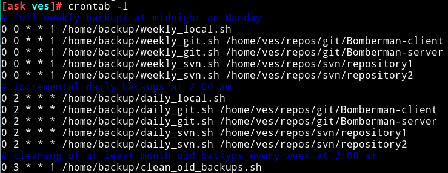

# ASK Sprawozdanie
## Skrypty do wykonywania kopii bezpieczeństwa plików i repozytoriów w Linux

### Wstęp
Skrypty były przygotowywane na maszynie wirtualnej z systemem operacyjnym Linux Manjaro, jednakże pisane były w bashu z raczej ogólnodostępnymi komendami lub narzędziami na większości dystrybucji. Narzędzia wykorzystywane do tworzenia kopii i automatyzacji to `crontab`, `date`, `tar`, `git`, `svn`, `svnlook` oraz `svnadmin`. Dodatkowo do zapisu i odzyskiwania metadanych plików z repozytorii z użyciem `find`, `chown`, `chgrp`, `chmod` i `touch`.

Strukturę zapisu kopii zapasowych zdecydowaliśmy się podzielić na poszczególne źródła danych, a następnie na tygodnie. Każdy tygodniowy folder jest nazywany jako data utworzenia pełnej kopii zapasowej w formacie `YYYYmmdd` (np. `20210118` dla dnia 28.01.2021). Wewnątrz tygodniowego folderu znajduje się plik pełnej kopii zapasowej o nazwie `weekly.tar.gz` oraz kopie inkrementalne o nazwie `dailyX.tar.gz`, gdzie `X` jest numerem dnia tygodnia licząc od poniedziałku będącego numerem 1 (np. dla wtorku będzie `daily2.tar.gz`).

### Skrypty
Zważając na objętość tego sprawozdania nie dodajemy tutaj samych skryptów lecz tylko ich opisy, sama
zawartość jest dostępna w [repozytorium na GitHubie](https://github.com/Ves5/ASK-project).

#### Tworzenie kopii zapasowych
Tworzenie kopii dla każdego typu danych jest bardzo podobnym procesem. Najpierw tworzymy raz w tygodniu (dokładnie w poniedziałek) pełną kopię, która zawiera pełną informację o plikach znajdujących się w folderze lub repozytorium. Następnie codziennie pojawia się dodatkowa kopia przyrostowa, która zawiera już tylko różnice względem poprzedniej kopii zapasowej. Warto wspomnieć, że dla ułatwienia skryptów przywracania kopii z konkretnego dnia oraz ustawień cykliczności, kopia dzienna tworzona jest również w dniu tworzenia pełnej kopii, oczywiście po jej stworzeniu. 

##### Pliki
Zacznę od opisu skryptów dla kopii bezpieczeństwa zwykłych plików. Postanowiliśmy użyć do tego celu narzędzia `tar`, dzięki czemu dane od razu są spakowane w skompresowane archiwum. 

Działanie skryptu tygodniowego zaczyna się od usunięcia pliku "snapshot", który zawiera metadane o obecnym stanie zarchwizowanego folderu potrzebne do poprawnego generowania kopii przyrostowych. Usuwamy go, gdyż zdecydowaliśmy, że ten plik ma stałą nazwę. Natomiast przy tworzeniu kopii, jeśli zostanie podana ścieżka do nieistniejącego (stąd usuwanie go) pliku to tworzona jest pełna kopia. Każde tygodniowe zestawienie kopii znajduje się w osobnym folderze, więc następnie tworzony jest folder dla nowego tygodnia, który zawiera w nazwie datę obecnego dnia. Potem jest najważniejsza część skryptu, czyli wywołanie komendy `tar`, która tworzy pełną kopię folderu.

Dodatkowo postanowiliśmy stworzyć skrót (symlink) do folderu dla kopii z obecnego tygodnia, dzięki czemu skrypt dzienny w łatwy sposób może odnaleźć właściwy folder. Zatem na zakończenie skryptu tygodniowego usuwany jest poprzedni skrót oraz tworzony skrót do obecnego folderu.

Codziennie wykonywane skrypty dla plików są bardzo proste i składają się tylko z jednej komendy. Jest to komenda `tar`, która jako argument ma obecną wersję pliku snapshot, dzięki czemu kopia zawiera tylko zmiany w plikach od poprzedniego wykonania kopii. Warto wspomnieć, że nazwa pliku zawiera numer porządkowy dnia tygodnia.

##### Git
Zasada działania jest tutaj taka sama, jednak repozytorium powoduje pewne dodatkowe problemy, zatem wymienię tylko różnice i dodane rzeczy względem tworzenia kopii plików.

Do stworzenia pełnej kopii wchodzimy do folderu z repozytorium i używamy komendy `git bundle` bez wskazania konkretnej poprzedniej wersji, czyli tworzymy kopię zawierającą wszystkie pliki wpisane do repozytorium. Następnie wykonujemy akcję, która jest odpowiednikiem tworzenia pliku snapshot. W tym przypadku tworzymy tag w repozytorium o stałej nazwie, który wskazuje na moment tworzenia kopii zapasowej. Potem na podstawie tego tagu możliwe jest stworzenie kopii inkrementalnej. Dodatkowo samodzielnie zapisujemy pełną scieżkę do folderu repozytorium w oddzielnym pliku, gdyż kopia poprzez `git` nie zawiera takiej informacji. Również wykonywanie kopii przez komendy `git` nie zawiera informacji o metadanych, takich jak właściciel pliku, czy prawa do odczytu. W celu zapisania tych informacji wykonujemy tutaj stworzony przez nas skrypt. Ostatnia rzecz do wykonania to skompresowanie i zarchwizowanie stworzonych plików do czego wykorzystujemy ponownie narzędzie `tar`.

Natomiast codzienne kopie przyrostowe są tworzne tylko, jeśli były zmiany od stworzenia tagu wskazującego na poprzednią kopię zapasową. Było to konieczne, gdyż `git bundle` nie pozwala na stworzenie paczki, jeśli nie było żadnych zmian. Zatem najpierw sprawdzamy, czy pojawiły się jakieś commity od poprzedniej kopii bezpieczeństwa. Tylko jeśli takie były to tworzymy paczkę zawierającą zmiany. Ponownie korzystamy z `git bundle`, jednak tym razem podajemy dodatkowy argument wskazujący na konkretnę wersję repozytorium wskazaną odpowienim tagiem. Dzieki temu paczka zawiera informację tylko o zmianach, które wystąpiły później niż ta wskazana wersja repo. Potem tworzymy na nowo tag o tej samej nazwie, zapisujemy metadane oraz całość kompresujemy.

##### SVN
Zasada działania jest identyczna, jednak w sposób oczywisty musieliśmy zastąpić elementy związane z gitem na komendy związane z repozytoriami svn.

Pełne kopie tworzone są poprzez komendę `svn dump`, która w podstawowej postaci zapisuję stan całego repozytorium. Zamiast tagu, tym razem zapisujemy do pliku numer obecnej wersji repozytorium (revision number) z użyciem `svnlook youngest`. Tak samo musimy zapisać pełną ścieżkę do repozytorium oraz metadane, które względem repozytoriów git dodatkowo zawierają czas stworzenia pliku. Na koniec oczywiście wszystki pliki kompresujemy i pakujemy do archiwum poprzez użycie `tar`.

W kopiach przyrostowych tak samo najpierw sprawdzamy czy wystąpiły zmiany w repozytorium poprzez porównanie obecnego numeru wersji z wcześniej zapisaną wersją. Jeśli wystąpiły zmiany to wykonujemy kopię również z wykorzystaniem `svnadmin dump`, jednak tym razem z dodatkową opcją `--incremental`, gdzie wskazujemy zakres wersji, które mają być uwzględnione. Dzięki temu kopia zawiera zmiany tylko od poprzedniej kopii bezpieczeństwa, gdyż podajemy zakres od zapisanego numeru wersji do obecnej wersji. Dalsza część skryptu jest identyczna z tygodniową i zawiera zapis numeru wersji, ścieżki, metadanych oraz kompresję wszystkich plików.

#### Odzyskiwanie kopii zapasowych
Skrypty do odczytywania mają trochę bardziej skomplikowaną strukturę. Mają one dwa tryby. Jeśli użytkownik nie poda dokładnej daty do odzyskiwana jest najbardziej aktualna kopia. Natomiast dodatkowo użytkownik może podać datę jako argument (w formacie zgodnym z zapisem dat w systemie Linux), wtedy skrypt przywraca stan na podany dzień, jeśli takowa kopia zapasowa istnieje.

##### Pliki
Ponownie zacznę od opisania skryptu dotyczącego plików. Jeśli ma być odzyskana najnowsza kopia, to skrypt wchodzi w folder z najnowszą kopią bezpieczeństwa, następnie rozpakowuje poprzez `tar` pełną kopię "tygodniową". Następnie w taki sam sposób wypakowuje w odpowiedniej kolejności paczki dzienne. Warto wspomnieć, że kopie zawierają pełną ścieżkę do folderów, więc są wypakowywane w folderze`/`.

Chęć odzyskania danych z konkretnego dnia powoduje trochę kompilkacji. Najpierw znajdujemy odpowiedni folder po nazwie, jest to folder z najbliższą wcześniejszą lub taką samą datą co żądana data przez użytkownika. Następnie wypakowywana jest pełna kopia. W związku z tym, że dla każdego dnia jest wykonywana kopia, nawet jeśli nie było zmian, to wypakowujemy tyle pierwszych kopii dziennych z obecnego folderu, ile jest dni między wskazaną przez użytkownika datą (włącznie), a dniem kiedy została stworzona pełna kopia. Do wyliczenia liczby dnii wykorzystujemy stworzoną przez siebie prostą funkcję `datediffs`, która zwraca liczbę dni między dwoma datami i korzysta z narzędzia `date`.

##### Git
Najpierw działanie przy odzyskiwaniu najbardziej aktualnej kopii bezpieczeństwa. Wpierw odczytujemy, zapisaną wcześniej przy tworzeniu kopii, lokalizację repozytorium na dysku i usuwamy wersję repo, która obecnie znajduje się na dysku w tym samym miejscu. Następnie rozpakowujemy pliki związane z pełną kopią tygodniową i tworzymy repozytorium na podstawie stworzonej wcześniej paczki (bundle) poprzez `git clone`. Dodatkowo wykonujemy jak skrypt polecenia, które przywracają metadane (automatycznie tworzone pliki `*.metadata`) oraz usuwamy lokalnie pliki z zarchiwizowanej kopii, które już nie są potrzebne po odzyskaniu danych. Potem wykonujemy te same działania dla kopii przyrostowych z tą różnicą, że zamiast tworzyć repozytorium, to wczytujemy zmiany do repozytorium z użyciem `git pull`.

Odzyskiwanie stanu z konkretnego dnia wprowadza podobne komplikacje co przy plikach, jednak trzeba pamiętąc, że jeśli nie było zmian w repozytorium, to jego kopia nie została wykonana. Zatem zamiast odzyskiwać N pierwszych kopii przyrostowych jak poprzednio (N - liczba dni między żądaną datą, a datą wykonania pełnej kopii), tym razem obliczmy najpierw N, a potem przywracamy kopie dzienne, których nazwy wskazują, że były stworzone nie później niż wskazana przez użytkownika data (paczki `dailyX`, takie, że $X<N+1$).

##### Repozytoria SVN
Sposób wyboru plików do odzyskania jest zbieżny z tym dla repozytoriów git, zatem pozwolę sobie opisać tylko sekwencję komend potrzebnych do odzyskania repozytorium i już pominę pozostałe aspekty, takie jak odzyskanie metadanych. Dla każdej kopii zapasowej, czy to pełnej czy przyrostowej, zmiany są wczytywane z pliku dump (`*.dmp`) do repo poprzez komendę `svnadmin load`. Dodatkowo przed wczytaniem pełnej kopii ponownie trzeba usunąć obecną wersję repozytorium oraz stworzyć repozytorium na nowo z użyciem `svnadmin create`.

#### Zapisywanie i odzyskiwanie metadanych
Jak już wcześniej wspomniane, w celu zapisania metadanych plików repozytoriów stosowany jest osoby skrypt. Działanie polega na użyciu narzędzia `find`. Iteruje ono po wszystkich plikach i folderach od bieżącej lub podanej lokalizacji i dla każdego znalezionego obiektu zapisuje do specjalnego pliku `*.metadata` komendy które po wykonaniu nadadzą plikom te same metadane co podczas zapisu.

Są 2 wersje tego skryptu, dla obu typów wykorzystywanych repozytorii, jednakże różnią się jedynie elementem odtwarzania danych o dacie ostatniego dostępu do pliku. Dla każdego pliku zapisywane są metadane o właścicielu, grupie oraz atrybutach, dla plików z repozytorium SVN także zapisywana jest komenda dla daty, jak wyżej wspomniane.

W celu odzyskania metadanych wystarczy uruchomić dany plik komendą `sh` w folderze repozytorium po odtworzeniu plików, jest to automatycznie robione w skryptach odtwarzających kopie bezpieczeństwa.

#### Usuwanie starych kopii
Proces działania skryptu czyszczącego jest bardzo prosty i wykorzystuje wcześniej wspomnianą funkcję `datediffs`. Najpierw czyszczone są kopie danych lokalnych, dla każdego folderu tygodniowego porównywana jest data z nazwy folderu z aktualną i usuwany jest folder jeżeli mineło 30 dni od utworzenia. Następnie jest przejście do lokalizacji wspólnej repozytoriów gitowych i ta sama procedura jest wykonywana wewnątrz kolejnych repozytoriów. Repozytoria SVN są traktowane w identyczny sposób.

### Crontab
Część skryptów wymaga przywilejów roota do poprawnego wykoniania, dlatego ustawienia cyklicznego uruchamiania są wykonane w crontabie użytkownika root. Pełne kopie bezpieczeństwa są wykonywane w poniedziałki o północy (zapis cron: `0 0 * * 1`), następnie wykonywane są inkrementalne kopie codziennie o drugiej w nocy, ważne żeby nie zostały wykonane przed kopiami pełnymi w poniedziałki (zapis cron: `0 2 * * *`). Na koniec wykonywane jest sprzątanie starych kopii zapasowych, co tydzień w poniedziałek (zapis cron: `0 3 * * 1`). Pełne wpisy do crona znajdują się na poniższym zdjęciu.

